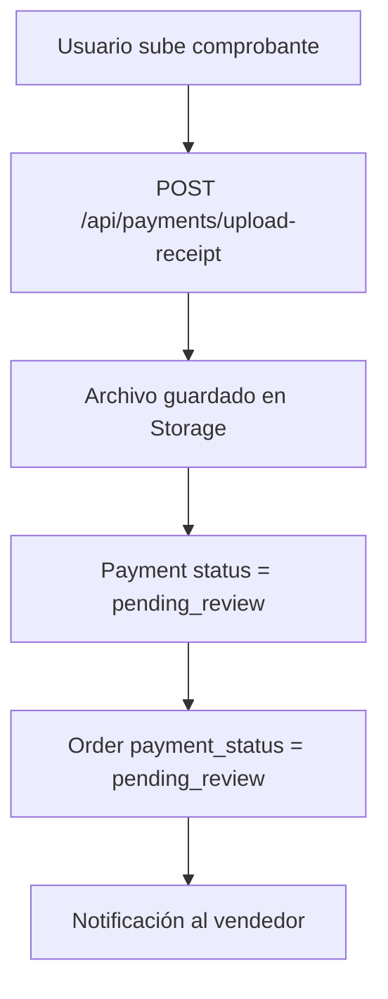
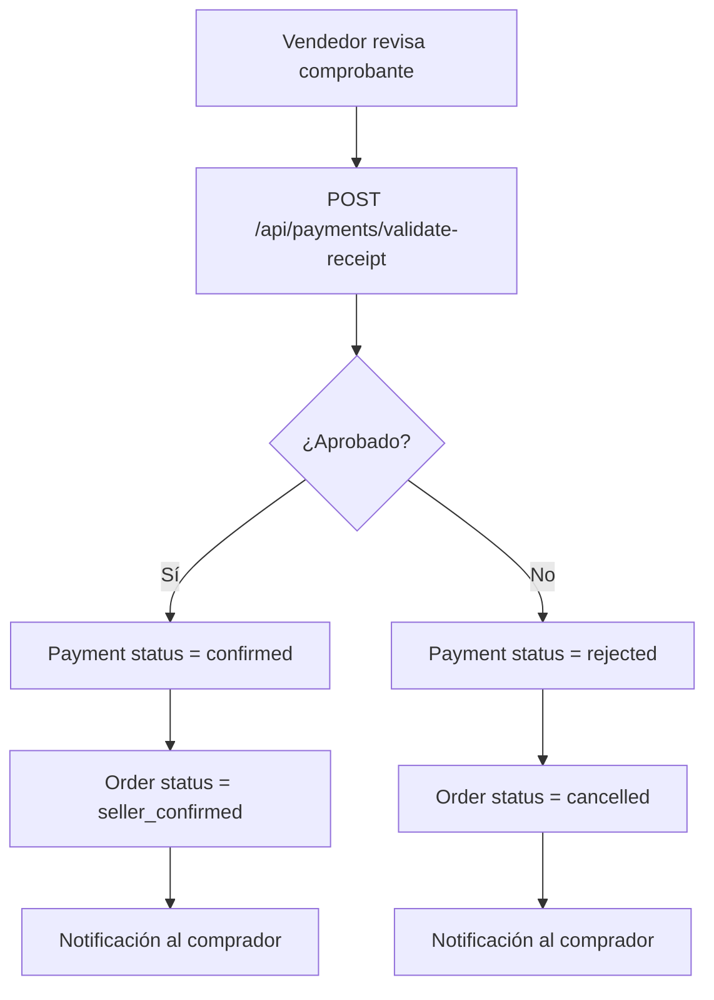

# Checkout Robusto - Sistema de Expiración y Transferencias

## 📋 Descripción

Este sistema mejora el checkout existente agregando:

- **Expiración de pedidos**: Los pedidos expiran automáticamente si no se confirma el pago
- **Sistema de transferencias**: Subida de comprobantes y validación por vendedores
- **Notificaciones en tiempo real**: Alertas para cada cambio de estado
- **Panel de validación**: Interface para que vendedores validen comprobantes
- **Tests de integración**: Suite completa de pruebas del flujo

## 🚀 Instalación

### 1. Ejecutar Scripts SQL

Ejecuta estos scripts en el **Supabase SQL Editor** en el siguiente orden:

```sql
-- 1. Schema principal
astro-sitio/scripts/checkout-robusto-schema.sql

-- 2. Configuración de Storage
astro-sitio/scripts/setup-storage-buckets.sql
```

### 2. Configurar Variables de Entorno

Asegúrate de tener estas variables en tu `.env`:

```env
PUBLIC_SUPABASE_URL=tu_supabase_url
SUPABASE_SERVICE_ROLE_KEY=tu_service_role_key
```

### 3. Configurar Cron Job (Opcional)

Para cancelar pedidos expirados automáticamente, configura un cron job que llame a:

```
GET /api/cron/cancel-expired-orders
```

**Ejemplo con GitHub Actions:**
```yaml
name: Cancel Expired Orders
on:
  schedule:
    - cron: '*/5 * * * *' # Cada 5 minutos

jobs:
  cancel-expired:
    runs-on: ubuntu-latest
    steps:
      - name: Cancel expired orders
        run: curl -X GET ${{ secrets.SITE_URL }}/api/cron/cancel-expired-orders
```

## 🔄 Flujo del Sistema

### 1. Creación de Pedido
```mermaid
graph TD
    A[Usuario completa checkout] --> B[place_order_with_expiration]
    B --> C[Pedido creado con expires_at = now() + 15min]
    C --> D[Pago creado con status = pending]
    D --> E[Notificaciones enviadas]
    E --> F[Carrito limpiado]
```

### 2. Subida de Comprobante (Transferencias)


### 3. Validación por Vendedor


### 4. Cancelación Automática
```mermaid
graph TD
    A[Cron job ejecuta] --> B[GET /api/cron/cancel-expired-orders]
    B --> C[cancel_expired_orders()]
    C --> D[Busca pedidos expirados]
    D --> E[Status = cancelled]
    E --> F[Payment status = rejected]
    F --> G[Notificaciones de cancelación]
```

## 📁 Archivos Creados

### Backend (APIs)
- `src/pages/api/cron/cancel-expired-orders.ts` - Job para cancelar pedidos expirados
- `src/pages/api/payments/upload-receipt.ts` - Subida de comprobantes
- `src/pages/api/payments/validate-receipt.ts` - Validación de comprobantes

### Componentes React
- `src/components/react/PaymentValidationPanel.tsx` - Panel de validación para vendedores
- `src/components/react/RealTimeNotifications.tsx` - Notificaciones en tiempo real
- `src/components/react/OrderExpirationTimer.tsx` - Timer de expiración
- `src/components/react/TransferReceiptUpload.tsx` - Subida de comprobantes

### Scripts y Tests
- `scripts/checkout-robusto-schema.sql` - Schema completo de la base de datos
- `scripts/setup-storage-buckets.sql` - Configuración de Storage
- `scripts/test-checkout-robusto.js` - Tests de integración

## 🔧 Uso de los Componentes

### 1. Timer de Expiración
```tsx
import OrderExpirationTimer from './components/react/OrderExpirationTimer';

<OrderExpirationTimer 
  expiresAt="2024-01-01T15:30:00Z"
  onExpired={() => console.log('Pedido expirado')}
/>
```

### 2. Subida de Comprobante
```tsx
import TransferReceiptUpload from './components/react/TransferReceiptUpload';

<TransferReceiptUpload
  orderId="order-123"
  onUploadSuccess={(url) => console.log('Comprobante subido:', url)}
  onUploadError={(error) => console.error('Error:', error)}
/>
```

### 3. Panel de Validación (Vendedores)
```tsx
import PaymentValidationPanel from './components/react/PaymentValidationPanel';

<PaymentValidationPanel sellerId="seller-123" />
```

### 4. Notificaciones en Tiempo Real
```tsx
import RealTimeNotifications from './components/react/RealTimeNotifications';

<RealTimeNotifications 
  userId="user-123"
  onNotificationReceived={(notification) => console.log('Nueva notificación:', notification)}
/>
```

## 🧪 Ejecutar Tests

```bash
cd astro-sitio
node scripts/test-checkout-robusto.js
```

Los tests verifican:
- ✅ Creación de pedidos con expiración
- ✅ Subida de comprobantes
- ✅ Validación por vendedores
- ✅ Cancelación automática
- ✅ Sistema de notificaciones

## 📊 Monitoreo

### Verificar Pedidos Expirados
```sql
SELECT * FROM orders 
WHERE status = 'placed' 
AND expires_at < NOW() 
AND payment_status = 'pending';
```

### Verificar Comprobantes Pendientes
```sql
SELECT * FROM pending_payments_view;
```

### Estadísticas de Storage
```sql
SELECT * FROM get_storage_stats();
```

### Limpiar Archivos Huérfanos
```sql
SELECT cleanup_orphaned_receipts();
```

## 🔒 Seguridad

### Políticas RLS
- Los usuarios solo pueden subir comprobantes para sus propios pedidos
- Los vendedores solo pueden validar comprobantes de sus pedidos
- Las notificaciones solo son visibles para el usuario correspondiente

### Validación de Archivos
- Tipos permitidos: JPG, PNG, PDF
- Tamaño máximo: 5MB
- Validación de extensión y MIME type

### Autenticación
- Todos los endpoints requieren autenticación
- Uso de service role key para operaciones administrativas
- Validación de permisos en cada operación

## 🚨 Troubleshooting

### Error: "supabaseUrl is required"
- Verifica que `PUBLIC_SUPABASE_URL` esté configurada
- Asegúrate de usar la URL correcta de tu proyecto

### Error: "No se puede subir archivo"
- Verifica que el bucket 'receipts' existe en Storage
- Revisa las políticas RLS del bucket
- Confirma que el usuario tiene permisos

### Error: "Función no encontrada"
- Ejecuta el script `checkout-robusto-schema.sql` completo
- Verifica que todas las funciones se crearon correctamente

### Pedidos no expiran automáticamente
- Configura el cron job para llamar `/api/cron/cancel-expired-orders`
- Verifica que el endpoint esté accesible
- Revisa los logs del servidor

## 📈 Mejoras Futuras

1. **WebSockets reales** en lugar de polling para notificaciones
2. **Integración con APIs bancarias** para validación automática
3. **Dashboard de analytics** para vendedores
4. **Sistema de reputación** basado en validaciones
5. **Notificaciones push** para móviles
6. **Múltiples métodos de pago** (Stripe, PayPal, etc.)

## 🤝 Contribuir

1. Fork el repositorio
2. Crea una rama para tu feature
3. Ejecuta los tests
4. Envía un pull request

## 📄 Licencia

MIT License - ver archivo LICENSE para más detalles.


