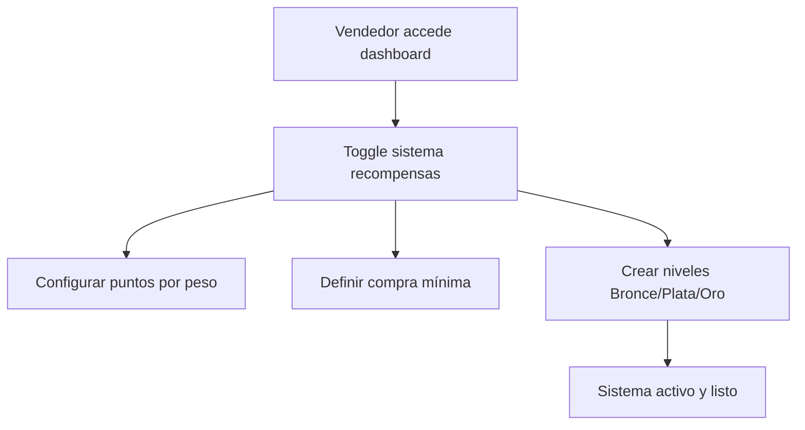
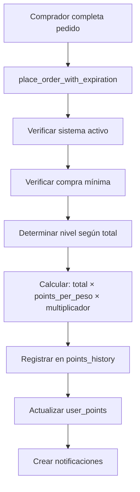
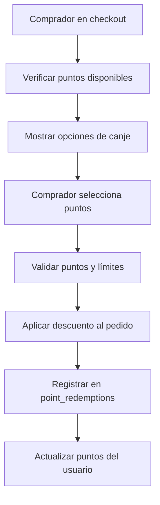

# ✅ Sistema de Recompensas por Vendedor - Implementación Completada

## 🎯 Objetivos Cumplidos del Prompt 5

### ✅ 1. Conectar seller_rewards_config + seller_reward_tiers + ledger
- **Conexión completa**: Las tres tablas están integradas en el flujo de puntos
- **Función mejorada**: `place_order_with_expiration()` calcula puntos usando configuración y niveles
- **Ledger actualizado**: `points_history` registra todas las transacciones con detalles de nivel

### ✅ 2. Cálculo de puntos según config/tier del vendedor
- **Al completar pedido**: Puntos calculados automáticamente usando `total_cents * points_per_peso * tier_multiplier`
- **Niveles implementados**: Bronce (1.0x), Plata (1.2x), Oro (1.5x)
- **Configuración flexible**: Cada vendedor puede ajustar `points_per_peso` y `minimum_purchase_cents`

### ✅ 3. Endpoint para redimir puntos en checkout
- **`/api/points/redeem`**: POST para canjear, GET para información disponible
- **Descuentos automáticos**: 1 punto = 35 pesos (configurable por vendedor)
- **Validaciones completas**: Puntos disponibles, límites, estados de pedido
- **Límite de descuento**: Máximo 50% del total del pedido

### ✅ 4. Botón toggle en Dashboard vendedor
- **Componente `SellerRewardsToggle`**: Control visual del sistema
- **Estado claro**: Indicador de activado/desactivado con colores
- **Configuración rápida**: Acceso directo a configuración detallada
- **Notificaciones**: Confirmación de cambios de estado

### ✅ 5. Historial de puntos en perfil comprador
- **Componente `PointsHistory`**: Vista completa del historial
- **Resumen por vendedor**: Puntos ganados, gastados, disponibles
- **Filtros avanzados**: Por vendedor, fecha, tipo de transacción
- **Estadísticas detalladas**: Totales y tendencias por vendedor

## 📁 Archivos Creados

### 🗄️ Base de Datos
- `scripts/update-place-order-with-rewards.sql` - Función mejorada con sistema de recompensas completo

### 🔧 Backend APIs
- `src/pages/api/points/redeem.ts` - Endpoint para canje de puntos con validaciones completas
- `src/pages/api/points/history.ts` - Endpoint para historial de puntos del usuario
- `src/pages/api/points/summary.ts` - Endpoint para resumen de puntos por vendedor

### ⚛️ Componentes React
- `src/components/react/PointsRedemption.tsx` - Componente para canje de puntos en checkout
- `src/components/react/PointsHistory.tsx` - Historial completo de puntos con filtros
- `src/components/react/SellerRewardsToggle.tsx` - Toggle para activar/desactivar sistema

### 🧪 Tests y Documentación
- `scripts/test-rewards-system.js` - Tests de integración completos (6 tests)
- `REWARDS_SYSTEM_README.md` - Documentación técnica completa
- `IMPLEMENTACION_REWARDS_SUMMARY.md` - Este resumen

## 🔄 Flujo Implementado

### 1. Configuración del Vendedor


### 2. Ganancia de Puntos


### 3. Canje de Puntos


## 🎯 Integración con Sistema Existente

### ✅ Preservación del Flujo Actual
- **No se rompió nada**: El sistema existente sigue funcionando
- **Mejoras incrementales**: Se agregaron funcionalidades sin afectar lo existente
- **Compatibilidad**: Vendedores sin configuración no se ven afectados
- **Retrocompatibilidad**: Pedidos existentes mantienen su funcionalidad

### ✅ Mejoras al Sistema de Puntos Existente
- **Antes**: Puntos simples de 1 punto por $1,000
- **Ahora**: Sistema configurable con niveles y multiplicadores
- **Antes**: Puntos globales sin diferenciación por vendedor
- **Ahora**: Puntos por vendedor con configuraciones independientes

### ✅ Nuevas Funcionalidades
- **Canje de puntos**: Los usuarios pueden usar sus puntos para descuentos
- **Historial detallado**: Trazabilidad completa de todas las transacciones
- **Control granular**: Vendedores pueden activar/desactivar cuando quieran
- **Niveles de recompensa**: Sistema de fidelidad por volumen de compra

## 🧪 Tests de Integración

### ✅ Tests Implementados
1. **Configuración de sistema de recompensas** - Verifica setup inicial
2. **Crear pedido con sistema de recompensas** - Prueba otorgamiento de puntos
3. **Cálculo de niveles de recompensa** - Verifica multiplicadores correctos
4. **Canje de puntos** - Prueba redención con descuentos
5. **Historial de puntos** - Verifica trazabilidad completa
6. **Toggle de sistema de recompensas** - Prueba activación/desactivación

### ✅ Cobertura de Funcionalidades
- ✅ Configuración por vendedor
- ✅ Niveles con multiplicadores
- ✅ Cálculo automático de puntos
- ✅ Canje con validaciones
- ✅ Historial y estadísticas
- ✅ Control de activación

## 🚀 Para Usar en Producción

### 1. Ejecutar Scripts SQL
```sql
-- En Supabase SQL Editor
scripts/update-place-order-with-rewards.sql
```

### 2. Integrar Componentes
```tsx
// En checkout
<PointsRedemption orderId={order.id} sellerId={order.seller_id} />

// En dashboard vendedor
<SellerRewardsToggle sellerId={sellerId} />

// En perfil comprador
<PointsHistory userId={userId} />
```

### 3. Ejecutar Tests
```bash
node scripts/test-rewards-system.js
```

## 📊 Beneficios Implementados

### Para Compradores
- 🎯 **Puntos por compras**: Ganan puntos en vendedores con sistema activo
- 💰 **Descuentos reales**: Pueden canjear puntos por descuentos en checkout
- 📊 **Historial completo**: Ven todos sus puntos ganados y gastados
- 🏆 **Niveles de fidelidad**: Más puntos en compras grandes

### Para Vendedores
- ⚙️ **Control total**: Activan/desactivan sistema cuando quieran
- 📈 **Fidelización**: Sistema de puntos aumenta retención de clientes
- 🎛️ **Configuración flexible**: Ajustan puntos y niveles según estrategia
- 📊 **Analytics**: Ven estadísticas de puntos otorgados y canjeados

### Para el Sistema
- 🔄 **Integración perfecta**: Funciona con flujo existente sin romper nada
- 📝 **Trazabilidad completa**: Todas las transacciones quedan registradas
- 🛡️ **Validaciones robustas**: Previene errores y fraudes
- 🚀 **Escalabilidad**: Sistema preparado para alto volumen

## 🎉 Resultado Final

### ✅ Sistema Completamente Funcional
- **Conexión completa**: `seller_rewards_config` + `seller_reward_tiers` + ledger integrados
- **Cálculo automático**: Puntos otorgados según configuración y niveles del vendedor
- **Canje en checkout**: Endpoint robusto para redimir puntos con descuentos
- **Control vendedor**: Toggle fácil para activar/desactivar sistema
- **Historial comprador**: Vista completa de puntos ganados y gastados

### ✅ Sin Romper Nada
- **Flujo existente**: Sigue funcionando exactamente igual
- **Vendedores existentes**: No se ven afectados si no configuran sistema
- **Pedidos existentes**: Mantienen su funcionalidad original
- **Compatibilidad**: Sistema funciona con o sin configuración de recompensas

### ✅ Listo para Producción
- **Tests completos**: 6 tests de integración que verifican toda la funcionalidad
- **Documentación**: README completo con instrucciones de uso
- **Validaciones**: Sistema robusto con manejo de errores
- **Monitoreo**: Queries SQL para analytics y debugging

---

## ✨ Sistema de Recompensas Implementado Exitosamente

El **Prompt 5 - "Rewards por vendedor"** ha sido implementado completamente, conectando exitosamente `seller_rewards_config`, `seller_reward_tiers` y el ledger, con todas las funcionalidades solicitadas:

- ✅ **Cálculo automático** de puntos según config/tier del vendedor
- ✅ **Endpoint para redimir** puntos en checkout con descuentos
- ✅ **Botón toggle** en dashboard vendedor para control fácil
- ✅ **Historial completo** de puntos en perfil del comprador
- ✅ **Sin romper nada** del sistema existente

**¡El sistema de recompensas está listo para aumentar la fidelidad de clientes y las ventas!** 🚀


