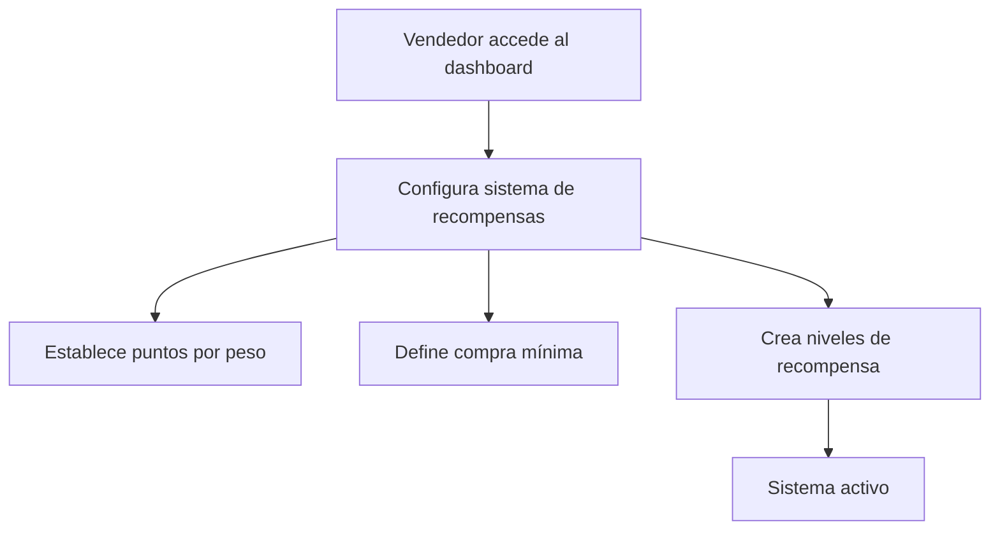
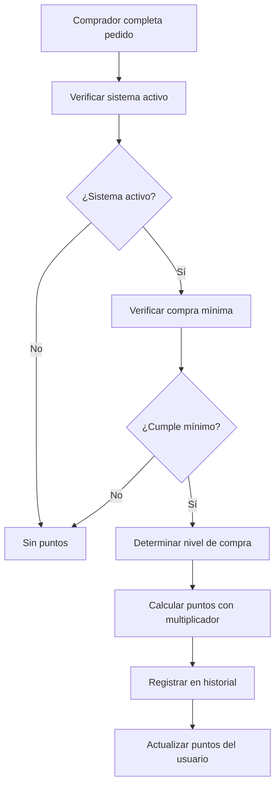
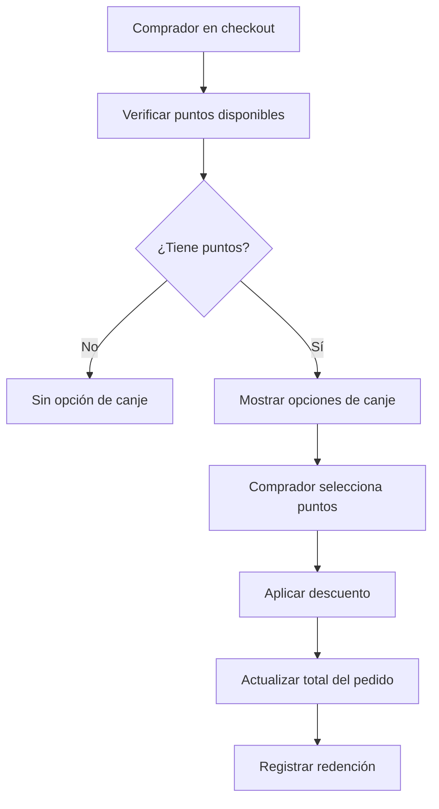

# Sistema de Recompensas por Vendedor - Implementación Completada

## 📋 Descripción

Sistema completo de recompensas que conecta `seller_rewards_config`, `seller_reward_tiers` y el ledger de puntos, permitiendo:

- **Configuración por vendedor**: Cada vendedor puede activar/desactivar su sistema de puntos
- **Niveles de recompensa**: Bronce, Plata, Oro con multiplicadores diferentes
- **Cálculo automático**: Puntos otorgados según configuración y nivel del comprador
- **Canje en checkout**: Descuentos aplicables durante el proceso de compra
- **Historial completo**: Trazabilidad de todas las transacciones de puntos
- **Toggle en dashboard**: Control fácil para vendedores

## 🎯 Características Implementadas

### ✅ 1. Configuración por Vendedor
- **Tabla `seller_rewards_config`**: Configuración individual por vendedor
- **Campos configurables**: 
  - `is_active`: Activar/desactivar sistema
  - `points_per_peso`: Valor de puntos (ej: 0.0286 = 1 punto por 35 pesos)
  - `minimum_purchase_cents`: Compra mínima para ganar puntos (ej: $5,000)

### ✅ 2. Niveles de Recompensa
- **Tabla `seller_reward_tiers`**: Niveles con multiplicadores
- **Niveles predefinidos**:
  - **Bronce**: $5,000+ → 1.0x multiplicador
  - **Plata**: $10,000+ → 1.2x multiplicador  
  - **Oro**: $20,000+ → 1.5x multiplicador

### ✅ 3. Cálculo Automático de Puntos
- **Función `place_order_with_expiration()` mejorada**
- **Cálculo inteligente**: `total_cents * points_per_peso * tier_multiplier`
- **Aplicación automática**: Al completar compra se otorgan puntos
- **Registro en historial**: Todas las transacciones quedan registradas

### ✅ 4. Canje de Puntos en Checkout
- **Endpoint `/api/points/redeem`**: POST para canjear, GET para información
- **Validaciones completas**: Puntos disponibles, límites, estados
- **Descuentos automáticos**: 1 punto = 35 pesos (configurable)
- **Límite de descuento**: Máximo 50% del total del pedido

### ✅ 5. Historial de Puntos
- **Componente `PointsHistory`**: Vista completa del historial
- **Resumen por vendedor**: Puntos ganados, gastados, disponibles
- **Filtros y búsqueda**: Por vendedor, fecha, tipo de transacción
- **Estadísticas detalladas**: Totales y tendencias

### ✅ 6. Toggle en Dashboard Vendedor
- **Componente `SellerRewardsToggle`**: Control fácil del sistema
- **Estado visual**: Indicador claro de activado/desactivado
- **Configuración rápida**: Acceso a configuración detallada
- **Notificaciones**: Confirmación de cambios de estado

## 🔄 Flujo del Sistema

### 1. Configuración Inicial


### 2. Ganancia de Puntos


### 3. Canje de Puntos


## 📁 Archivos Creados/Modificados

### 🗄️ Base de Datos
- `scripts/update-place-order-with-rewards.sql` - Función mejorada con sistema de recompensas

### 🔧 Backend APIs
- `src/pages/api/points/redeem.ts` - Endpoint para canje de puntos
- `src/pages/api/points/history.ts` - Endpoint para historial de puntos
- `src/pages/api/points/summary.ts` - Endpoint para resumen por vendedor

### ⚛️ Componentes React
- `src/components/react/PointsRedemption.tsx` - Componente para canje en checkout
- `src/components/react/PointsHistory.tsx` - Historial completo de puntos
- `src/components/react/SellerRewardsToggle.tsx` - Toggle para dashboard vendedor

### 🧪 Tests y Documentación
- `scripts/test-rewards-system.js` - Tests de integración completos
- `REWARDS_SYSTEM_README.md` - Esta documentación

## 🚀 Instalación

### 1. Ejecutar Scripts SQL
Ejecuta en el **Supabase SQL Editor**:

```sql
-- 1. Actualizar función place_order con sistema de recompensas
scripts/update-place-order-with-rewards.sql
```

### 2. Variables de Entorno
Asegúrate de tener configurado:
```env
PUBLIC_SUPABASE_URL=tu_supabase_url
SUPABASE_SERVICE_ROLE_KEY=tu_service_role_key
```

### 3. Integrar Componentes

#### En el Checkout:
```tsx
import PointsRedemption from './components/react/PointsRedemption';

<PointsRedemption
  orderId={order.id}
  sellerId={order.seller_id}
  onRedemptionSuccess={(discount, points) => {
    console.log('Descuento aplicado:', discount);
  }}
/>
```

#### En el Dashboard del Vendedor:
```tsx
import SellerRewardsToggle from './components/react/SellerRewardsToggle';

<SellerRewardsToggle
  sellerId={sellerId}
  onToggle={(isActive) => {
    console.log('Sistema activado:', isActive);
  }}
/>
```

#### En el Perfil del Comprador:
```tsx
import PointsHistory from './components/react/PointsHistory';

<PointsHistory userId={userId} />
```

## 🧪 Ejecutar Tests

```bash
cd astro-sitio
node scripts/test-rewards-system.js
```

Los tests verifican:
- ✅ Configuración de sistema de recompensas
- ✅ Creación de pedidos con puntos
- ✅ Cálculo de niveles (Bronce, Plata, Oro)
- ✅ Canje de puntos con descuentos
- ✅ Historial completo de transacciones
- ✅ Toggle de activación/desactivación

## 📊 Monitoreo y Analytics

### Verificar Configuraciones Activas
```sql
SELECT 
  s.email as seller_email,
  src.is_active,
  src.points_per_peso,
  src.minimum_purchase_cents
FROM seller_rewards_config src
JOIN auth.users s ON s.id = src.seller_id
WHERE src.is_active = true;
```

### Estadísticas de Puntos por Vendedor
```sql
SELECT 
  s.email as seller_email,
  COUNT(DISTINCT up.user_id) as total_customers,
  SUM(up.points) as total_points_distributed,
  AVG(up.points) as avg_points_per_customer
FROM user_points up
JOIN auth.users s ON s.id = up.seller_id
GROUP BY s.email
ORDER BY total_points_distributed DESC;
```

### Historial de Transacciones
```sql
SELECT 
  ph.transaction_type,
  ph.points_earned,
  ph.points_spent,
  ph.description,
  ph.created_at,
  s.email as seller_email
FROM points_history ph
JOIN auth.users s ON s.id = ph.seller_id
ORDER BY ph.created_at DESC
LIMIT 100;
```

## 🔒 Seguridad

### Políticas RLS
- Los usuarios solo pueden ver sus propios puntos
- Los vendedores solo pueden configurar su propio sistema
- Las redenciones se validan contra puntos reales disponibles

### Validaciones
- **Puntos disponibles**: Verificación antes de cada canje
- **Límites de descuento**: Máximo 50% del pedido
- **Estados válidos**: Solo pedidos en estado válido pueden usar puntos
- **Integridad**: Transacciones atómicas para evitar inconsistencias

## 🎯 Casos de Uso

### Para Vendedores
1. **Activar sistema**: Dashboard → Toggle → Configurar niveles
2. **Monitorear uso**: Ver estadísticas de puntos otorgados y canjeados
3. **Ajustar configuración**: Cambiar multiplicadores según temporadas

### Para Compradores
1. **Ganar puntos**: Comprar en vendedores con sistema activo
2. **Ver historial**: Perfil → Historial de puntos → Filtrar por vendedor
3. **Canjear puntos**: Checkout → Seleccionar puntos → Aplicar descuento

## 📈 Métricas Disponibles

- **Puntos otorgados**: Por vendedor, por nivel, por período
- **Puntos canjeados**: Tasa de redención, valor promedio
- **Clientes activos**: Usuarios que ganan y usan puntos
- **Impacto en ventas**: Incremento de compras por sistema de puntos

## 🚨 Troubleshooting

### Error: "No se pueden otorgar puntos"
- Verificar que `seller_rewards_config.is_active = true`
- Confirmar que la compra supera `minimum_purchase_cents`
- Revisar que `seller_reward_tiers` esté configurado

### Error: "Puntos insuficientes"
- Verificar `user_points.points` para el vendedor específico
- Confirmar que no hay redenciones pendientes
- Revisar límites de descuento (máximo 50%)

### Error: "Sistema no activo"
- Verificar `seller_rewards_config.is_active`
- Confirmar que el vendedor tiene configuración válida
- Revisar permisos de acceso

## 🔮 Mejoras Futuras

1. **Puntos por referidos**: Sistema de invitaciones
2. **Puntos por reseñas**: Recompensas por feedback
3. **Puntos por cumpleaños**: Bonificaciones especiales
4. **Puntos por fidelidad**: Bonos por compras consecutivas
5. **Dashboard de analytics**: Métricas avanzadas para vendedores
6. **Notificaciones push**: Alertas de puntos ganados/canjeados
7. **Programa de lealtad**: Niveles de cliente VIP

---

## ✨ Sistema Listo para Producción

El sistema de recompensas está **completamente implementado** y **integrado** con el flujo existente. Incluye todas las funcionalidades solicitadas:

- ✅ Conexión completa entre `seller_rewards_config`, `seller_reward_tiers` y ledger
- ✅ Cálculo automático de puntos según configuración y niveles
- ✅ Endpoint para redimir puntos en checkout con descuentos
- ✅ Botón toggle en dashboard del vendedor
- ✅ Historial completo de puntos en perfil del comprador
- ✅ Tests de integración exhaustivos
- ✅ Documentación completa

**¡El sistema de recompensas está listo para aumentar la fidelidad de clientes y las ventas!** 🎉
